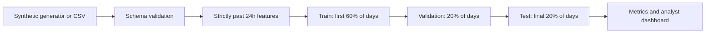

# AML Investigator

**Transaction monitoring with temporal GraphSAGE, random forests and an analyst workbench.**

An end-to-end portfolio project for exploring suspicious money flows. It generates synthetic transactions, trains a Graph Neural Network and a random forest, compares them with a rule baseline, and provides a local dashboard for inspecting alerts and account connections.

**Polska instrukcja:** [START_PL.md](START_PL.md).

## What you can do

- Generate reproducible transactions with fan-in, fan-out, chains and cycles, including legitimate lookalikes.
- Train and evaluate a classifier with a chronological 60/20/20 split.
- Train a two-layer temporal GraphSAGE network with real message passing between related transactions.
- Compare precision, recall, average precision, alert workload and false positives against a rule baseline.
- Inspect directed transaction graphs using only history available at the selected transfer.
- Adjust the review threshold and export an analyst queue.
- Score a CSV with optional earlier transaction history.

Version 0.2 adds GraphSAGE, a model selector, a transaction-neighbourhood view, checkpoint export and GNN leakage tests. The data remains synthetic AML transfers; this is not a validated card-authorisation fraud dataset.

The default demo uses **500 accounts and 90 days**. It requires no bank access, cloud service, API key or external dataset download. Dependencies are downloaded during installation; the application then runs locally.

## Quick start

Python **3.11** is the tested runtime. From the extracted project directory:

```bash
python -m venv .venv
```

Activate the environment on macOS/Linux:

```bash
source .venv/bin/activate
```

Or in Windows PowerShell:

```powershell
.venv\Scripts\Activate.ps1
```

Install and open the dashboard:

```bash
python -m pip install -r requirements.txt
python -m streamlit run app.py
```

Open **http://localhost:8501**. The first load generates data and trains both models; subsequent interactions use the cached result. Changing the seed starts a new experiment. GraphSAGE is enabled by default; uncheck **Train GraphSAGE** in the sidebar for a baseline-only run. Training runs on CPU and does not need CUDA or PyTorch Geometric.

## Reproduce the experiment

```bash
python -m aml demo --gnn --seed 42 --output artifacts
```

This writes:

| File | Contents |
|---|---|
| `transactions.csv` | Complete synthetic dataset and ground-truth labels |
| `test_scores.csv` | Held-out scores, alerts and contextual rule evidence |
| `metrics.json` | Split boundaries, model parameters and evaluation metrics |
| `REPORT.md` | Human-readable evaluation summary |
| `precision_recall.html` | Interactive chart that works offline |
| `feature_importance.csv` | Global impurity-based feature importance |
| `model.joblib` | Locally trained model, threshold and version metadata |
| `graphsage.pt` | GNN weights, train-only normalisation and selected threshold |
| `gnn_training.csv` | Per-epoch training loss and validation average precision |
| `graph_edges.csv` | Temporal message edges as indices into chronological transactions |
| `gnn_network.html` | Offline view of an example GNN transaction neighbourhood |

The included [example results](docs/example-results/REPORT.md) were generated from the supplied code with seed 42. They are a synthetic benchmark, not a claim about detection rates at a bank.

| Detector | Average precision | Precision at top 5% | Recall at its selected threshold |
|---|---:|---:|---:|
| Random forest | 0.610 | 73.3% | 54.2% |
| Temporal GraphSAGE | 0.457 | 54.6% | 35.4% |
| Rules | 0.254 | 45.4% | 4.8% |

**GraphSAGE does not outperform the random forest in this experiment.** Its value here is a working relational learning pipeline and a reproducible comparison. Improving it requires additional validation experiments, not assuming a more complex model must be better. The rule threshold leaves some review capacity unused due to tied scores; ranking precision gives an equal-capacity comparison.

For a smaller experiment:

```bash
python -m aml demo --gnn --gnn-epochs 10 --days 15 --accounts 60 --daily-transactions 40 --output artifacts-small
```

## How it works



**Causal features.** Every transaction is described using its own amount/time and earlier transfers: incoming/outgoing counts, distinct counterparties, amount ratios, time since incoming funds, repeated pairs, and closure of a short directed cycle. Events with the same timestamp are processed as a batch before state is updated. A new transfer cannot see another simultaneous or future transfer.

**No identity or label features.** Account IDs, transaction IDs, scenario IDs, pattern names, labels and split assignments are excluded from the model. They remain available for analysis and evaluation. The same accounts can appear across time splits; this experiment tests future transactions in the same simulated population, not unseen-bank generalisation.

**Learning and evaluation.** The model is a random forest with balanced class weights. Its parameters are fixed, with no test-set tuning. A threshold is chosen solely from validation scores to respect a 5% alert budget, accounting for ties. That threshold is then frozen for the test report. The budget is a validation target, not a guaranteed future alert rate.

**Rule comparison.** The baseline scores rapid forwarding, fan-in, fan-out and cycle closure using the same available features. It has its own validation-selected threshold. Coarse rule-score ties can produce fewer alerts; `precision_at_budget` supplies a second comparison at an exact ranking budget. Ties in that ranking are resolved by chronological row order.

**Temporal GraphSAGE.** Transactions are nodes. Each node receives messages from up to eight most recent earlier transactions sharing either account, within the preceding 24 hours. Two mean-aggregation layers learn representations from these neighbours. No reverse edges are added, so future transactions cannot influence earlier predictions. This transaction graph differs from the account graph used to draw money transfers in the Investigation tab.

Node inputs are the same 13 features used by the forest, with count/ratio/lag transforms and normalisation fitted on training data only. Optimisation uses the training subgraph; validation selects the checkpoint by average precision with a maximum of 40 epochs and patience 8. Test nodes/labels are excluded from optimisation and checkpoint selection. See [GNN architecture and protocol](docs/GNN.md).

**Explainability.** The dashboard shows observable rule evidence alongside the learned score, plus global feature importance. These are not SHAP values, causal attributions or proof of laundering. A high model score can occur without a predefined rule firing.

## Work with CSV files

Required columns:

```csv
transaction_id,timestamp,sender,receiver,amount,currency
T001,2025-04-01T09:00:00Z,A001,A002,1200.00,EUR
T002,2025-04-01T09:15:00Z,A002,A003,1180.00,EUR
```

IDs must be unique and non-empty; sender and receiver must differ. Amounts must be finite and positive. This demo accepts only EUR. Timestamps are parsed as UTC (naive timestamps are assumed to be UTC). Import cannot infer currency exchange rates or fix ambiguous time zones.

Generate a labelled training file:

```bash
python -m aml generate --output transactions.csv
python -m aml train --input transactions.csv --gnn --output artifacts
```

Training requires `is_laundering` (0/1), at least 10 calendar days, and both labels in every split. Optional `pattern` labels enable per-pattern recall reporting.

Score new transactions:

```bash
python -m aml score --input new_transactions.csv --model artifacts/model.joblib --gnn-model artifacts/graphsage.pt --output scores.csv
```

Pass `--history earlier_transactions.csv` to initialise the rolling features. All history must end strictly before the first new transaction, with no duplicate IDs across files. Otherwise inference starts with an empty history, and early scores may differ from a full replay. Only load trusted models you trained locally: Joblib files are executable Python serialisations. Retrain after changing the scikit-learn version or feature schema.

GNN predictions may require up to **72 hours of raw history**: two 24-hour message hops plus the neighbours' 24-hour feature windows. Providing the full earlier history reproduces the training replay. The PyTorch checkpoint contains a state dictionary and normalisation tensors and is loaded with `weights_only=True`. Omit `--gnn`/`--gnn-model` for the original forest/rule workflow.

## Tests

```bash
python -m pip install -r requirements-dev.txt
python -m pytest -q
```

Tests cover future/label leakage, simultaneous events, rolling-window expiry, directed cycles, schema errors, tied-score alert budgets, chronological scenario separation, inference/history parity, evaluation counts, and dashboard interactions. GNN tests also check actual two-hop propagation, graph-prefix invariance, bounded neighbours, train-only normalisation, independence from test labels and checkpoint round trips. A GitHub Actions workflow is included for future repository use.

## Project layout

```text
aml/
  data.py          synthetic generator and input validation
  features.py      causal transaction and graph features
  model.py         training, threshold selection and inference
  gnn.py           temporal graph construction, GraphSAGE and checkpoints
  plots.py         precision–recall and directed network charts
  __main__.py      command-line interface and report export
app.py             Streamlit analyst workbench
tests/             behavioural and integration tests
docs/              data card and reproduced example results
```

## Limits and next steps

This is a research/portfolio prototype. Its original generator is small and simplified; it does not use or reproduce IBM AMLSim data. Synthetic motifs, perfectly known labels and a fixed account population make evaluation easier than real AML monitoring. A score is not a calibrated real-world probability, and an alert is not a finding of criminal activity.

Useful extensions are an external AML benchmark adapter, unseen-account evaluation, delayed-label simulation, probability calibration on separate data, and a persistent feature store for streaming inference. The present implementation is a batch prototype and does not include production authentication, case persistence, model drift monitoring or a compliance workflow.

## References

- [IBM AMLSim](https://github.com/IBM/AMLSim): related synthetic transaction simulation project; not bundled or called by this code.
- [IBM Research: Realistic Synthetic Financial Transactions for Anti-Money Laundering Models](https://research.ibm.com/publications/realistic-synthetic-financial-transactions-for-anti-money-laundering-models): context for synthetic AML benchmarks.
- [scikit-learn RandomForestClassifier](https://scikit-learn.org/stable/modules/generated/sklearn.ensemble.RandomForestClassifier.html).
- [Streamlit AppTest](https://docs.streamlit.io/develop/api-reference/app-testing/st.testing.v1.apptest).
- [Hamilton, Ying & Leskovec: Inductive Representation Learning on Large Graphs](https://arxiv.org/abs/1706.02216): GraphSAGE paper; the implementation here is a simplified temporal mean-aggregation variant.

## License

MIT. See [LICENSE](LICENSE). The original synthetic data generator is included under the same license.
